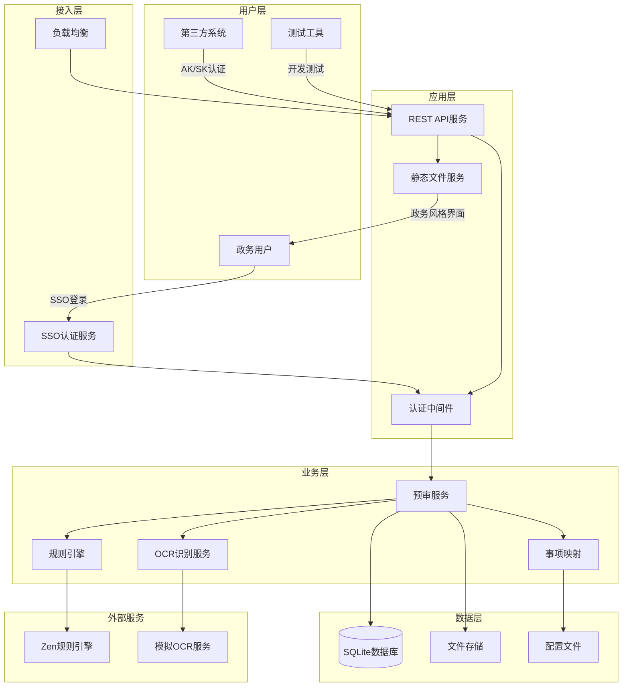
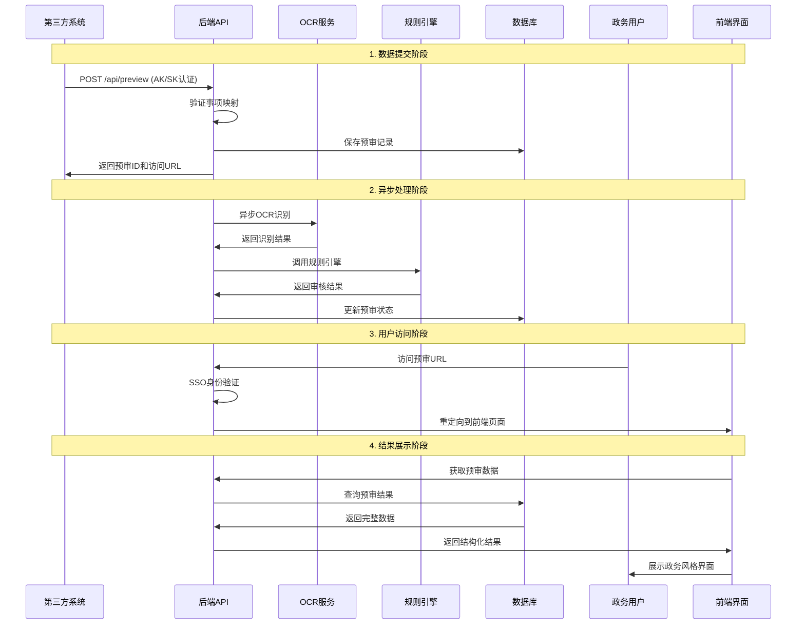
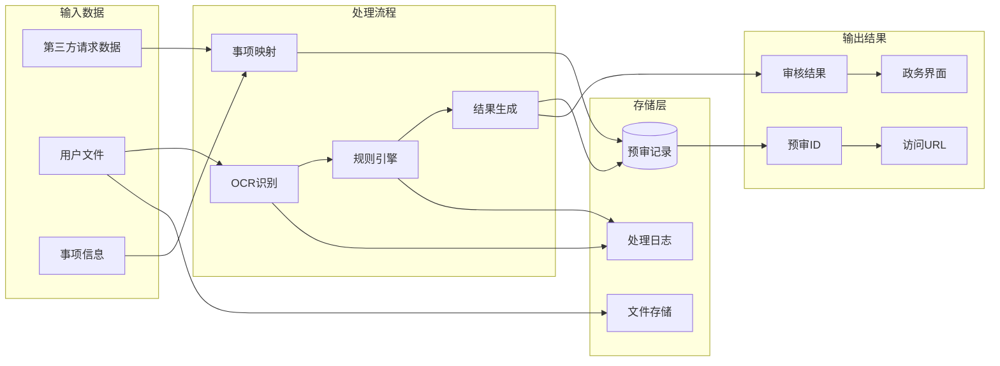

# 系统架构详细设计

## 🏗️ 整体架构图



## 🔄 业务流程图



## 📊 数据流转图



## 🔧 技术架构

### 后端技术栈
- **语言**: Rust 1.70+
- **框架**: Axum (异步Web框架)
- **数据库**: SQLite 3.x
- **异步运行时**: Tokio
- **序列化**: Serde JSON
- **HTTP客户端**: Reqwest
- **日志**: Tracing

### 前端技术栈
- **语言**: HTML5 + CSS3 + JavaScript ES6+
- **样式**: 政务风格CSS框架
- **交互**: 原生JavaScript
- **布局**: Flexbox + Grid
- **响应式**: Media Queries

### 部署架构
- **容器化**: Docker支持
- **进程管理**: 系统服务
- **负载均衡**: Nginx (可选)
- **监控**: 内置监控接口
- **日志**: 结构化日志输出

## 🔐 安全架构

### 认证机制
```
第三方系统 → AK/SK认证 → API访问
政务用户 → SSO认证 → 会话管理 → 页面访问
```

### 权限控制
- **API级别**: AK/SK验证
- **用户级别**: SSO身份验证
- **数据级别**: 用户ID匹配
- **会话级别**: Cookie会话管理

### 数据安全
- **传输加密**: HTTPS
- **存储加密**: 敏感数据加密
- **访问控制**: 基于用户身份
- **审计日志**: 完整操作记录

## 📈 性能架构

### 异步处理
```
请求接收 → 立即响应 → 后台异步处理 → 状态更新
```

### 缓存策略
- **配置缓存**: 事项映射配置内存缓存
- **静态资源**: 浏览器缓存
- **API响应**: 条件缓存
- **文件存储**: 本地文件系统

### 扩展性设计
- **水平扩展**: 无状态API设计
- **垂直扩展**: 异步处理支持
- **存储扩展**: 可切换数据库
- **服务拆分**: 模块化组件设计

## 🔄 状态管理

### 预审状态流转
```
pending → processing → completed
   ↓           ↓           ↓
 待处理    →  处理中    →  已完成
                ↓
              failed
                ↓
              处理失败
```

### 数据状态
- **材料状态**: passed, failed, warning, pending
- **整体结果**: Approved, RequiresCorrection, RequiresAdditionalMaterials, Pending
- **处理状态**: 异步任务状态跟踪

## 🛠️ 开发架构

### 项目结构
```
ocr-server-src/
├── src/                    # Rust源代码
│   ├── api/               # API路由和处理
│   ├── db/                # 数据库操作
│   ├── util/              # 工具函数
│   └── main.rs            # 主程序入口
├── static/                # 前端静态文件
│   ├── css/               # 样式文件
│   ├── js/                # JavaScript文件
│   ├── images/            # 图片资源
│   └── *.html             # HTML页面
├── config/                # 配置文件
├── docs/                  # 文档
└── scripts/               # 部署脚本
```

### 模块设计
- **API模块**: 路由定义和请求处理
- **数据库模块**: 数据访问层抽象
- **工具模块**: 通用工具和配置管理
- **中间件**: 认证、日志、错误处理

---

*架构文档版本: v1.0*  
*更新时间: 2024-07-25*
